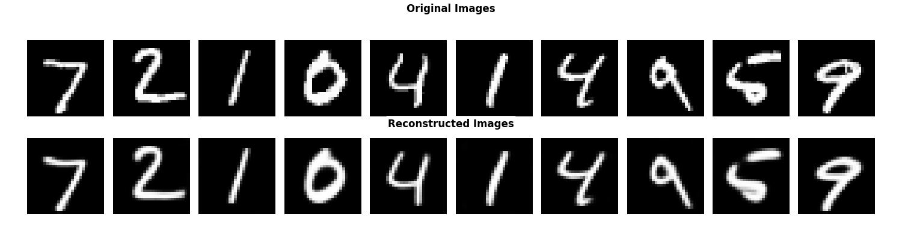
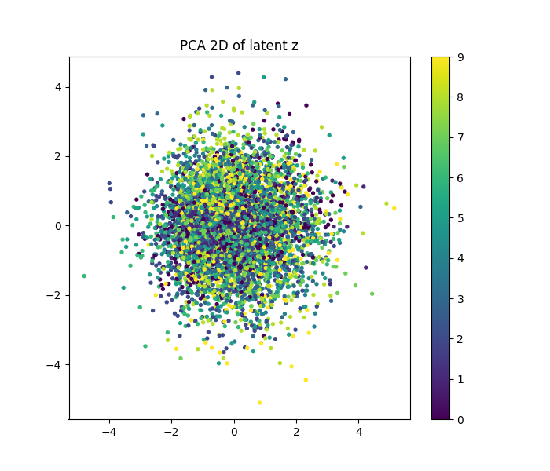
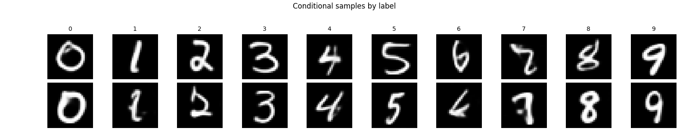

# Conditional VAE (CVAE)

## Summary and visualizations

The CVAE extends the VAE by conditioning both encoder and decoder on the class label $y$. This lets you guide generation by specifying a digit class.

- Conditioning: labels are injected into the encoder/decoder (e.g., via concatenation or embeddings) so the latent is informed by the target class.
- Controlled sampling: you can sample $z \sim \mathcal{N}(0, 1)$ and decode with a chosen label to generate class-specific digits.
- Reconstructions: expect reconstructions similar to VAE, but with better control over class identity.

Example placeholders:

<figure style="text-align: center;">
  
  <figcaption style="font-style: italic;">Figure: Originals vs CVAE reconstructions conditioned on labels.</figcaption>
</figure>

<figure style="text-align: center;">
  
  <figcaption style="font-style: italic;">Figure: PCA 2D projection of CVAE latent vectors, colored by digit label.</figcaption>
</figure>

<figure style="text-align: center;">
  
  <figcaption style="font-style: italic;">Figure: Samples from N(0, 1) decoded with a fixed label (class-conditional generation).</figcaption>
</figure>

- A CVAE is useful when you need controllable generation (choose a digit) while still benefiting from a structured latent prior. The trade-off is that conditioning slightly constrains the latent space, so diversity within a class can depend on how well labels are injected.

## Code
- Model: `CVAE`, `CVAE_Encoder`, `CVAE_Decoder` in `modules/cvae/cvae.py`.
- Training loop: `modules/cvae/training.py`.
- CLI entry point: `main.py`.

## Training
Examples:

- MNIST
  - `python main.py --model CVAE --dataset mnist --latent_dim 32`
- Fashion-MNIST
  - `python main.py --model CVAE --dataset fashion_mnist --latent_dim 64`

## Outputs
- Checkpoints: `models/CVAE/`
- Visuals: `visu/<dataset>_cvae/` with `recon/`, `pca/`, `umap/`, `interp/`, `noise/`. ( if enabled in `main.py` )
