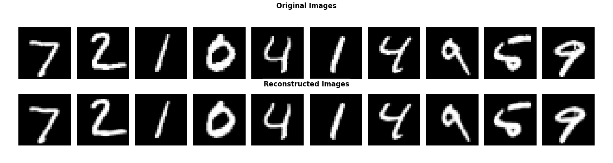
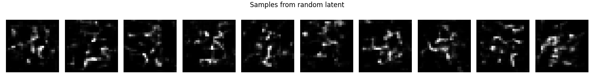
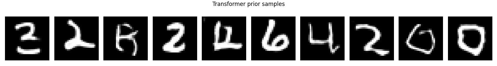
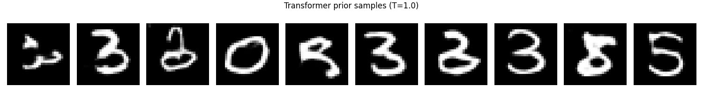
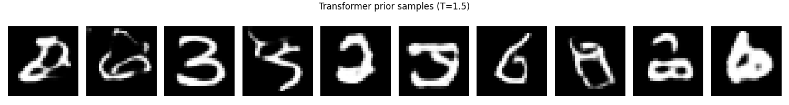

# VQ-VAE + Transformer Prior

## Summary and visualizations

This module trains a VQ‑VAE to compress images into discrete codebook indices, then trains a Transformer prior to model those indices auto‑regressively. At inference time, the Transformer samples an index sequence which is decoded by the VQ‑VAE into images.

- VQ‑VAE reconstructs inputs using quantized latents (discrete codes).
- The Transformer prior learns a distribution over code sequences (spatial grid).
- Sampling is controlled with a temperature (and optional top‑k).

Example placeholders:

<figure style="text-align: center;">
	
	<figcaption style="font-style: italic;">Figure: Originals vs VQ‑VAE reconstructions.</figcaption>
</figure>

<figure style="text-align: center;">
	
	<figcaption style="font-style: italic;">Figure: Samples decoded from random codebook indices.</figcaption>
</figure>

<figure style="text-align: center;">
	
	<figcaption style="font-style: italic;">Figure: Transformer prior samples decoded by the VQ‑VAE.</figcaption>
</figure>

Interpretation:
- **Reconstruction** is usually good: digit identity is preserved with small quantization artifacts.
- **Noise (random indices, no Transformer)** is not great, digits are often unrecognizable.
- **Transformer prior samples** are structured and coherent, typically better than a VAE prior on the same dataset.

<figure style="text-align: center;">
	
	<figcaption style="font-style: italic;">Figure: Temperature T=0.5 sharper but less diverse.</figcaption>
</figure>

<figure style="text-align: center;">
	
	<figcaption style="font-style: italic;">Figure: Temperature T=1.0 balanced quality/diversity.</figcaption>
</figure>

<figure style="text-align: center;">
	
	<figcaption style="font-style: italic;">Figure: Temperature T=1.5 more diverse but noisier.</figcaption>
</figure>


## Code
- Model: `VQVAE`, `VQVAEEncoder`, `VQVAEDecoder`, `VectorQuantizer` in `modules/vq_vae/vq_vae.py`.
- Transformer prior: `TransformerPrior` in `modules/vq_vae/tranformer_prior.py`.
- Training loops: `modules/vq_vae/training.py`.
- Inference helpers: `modules/vq_vae/inference.py`.
- CLI entry point: `main.py`.

## Training

Examples (from `main.py`):

- MNIST
	- `python main.py --model VQ-VAE --dataset mnist --epochs 50 --visualize`
- Fashion-MNIST
	- `python main.py --model VQ-VAE --dataset fashion_mnist --epochs 50 --visualize`

Outputs:
- Checkpoints: `models/VQ-VAE/encoder_<dataset>.pth`, `models/VQ-VAE/decoder_<dataset>.pth`, `models/VQ-VAE/vq_<dataset>.pth`
- Visuals: `visu/<dataset>_vqvae/` with `recon/`, `noise/`.

If you wired the Transformer prior training in `main.py`, it will write samples to:
- `visu/transformer_prior/prior/epoch_*.png`

## Image generation (inference)

Run:

```
python modules/vq_vae/inference.py
```

This script:
- loads VQ‑VAE encoder/decoder and codebook (`vq_*.pth`)
- loads the Transformer prior (`models/TransformerPrior/transformer_<dataset>.pth`)
- generates grids for multiple temperatures

Outputs:
- `visu/transformer_prior/temps_<dataset>/temp_*.png`

## Sampling temperature

- **T < 1**: more conservative, less diverse samples
- **T ≈ 1**: balanced quality/diversity
- **T > 1**: more diverse but noisier
